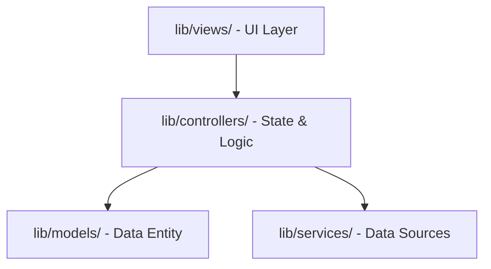
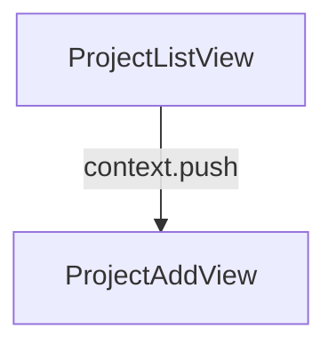

# ProjectKu — Freelancer Tracker Documentation

Selamat datang di dokumentasi resmi **ProjectKu**. Proyek ini adalah aplikasi pelacak manajemen proyek dan keuangan mandiri (*Freelance Tracker*) yang dibangun dengan **Flutter** dan diintegrasikan dengan **Firebase Cloud Firestore**.

---

## 🎯 Ringkasan Proyek (Overview)

**ProjectKu** dirancang untuk membantu *freelancer* melacak pengerjaan proyek, tenggat waktu (*due date*), anggaran pendapatan, serta status tagihan (*invoice*). 

Aplikasi ini menggunakan:
*   **Flutter SDK** (dengan dukungan Material 3).
*   **State Management:** [Riverpod](https://pub.dev/packages/flutter_riverpod) menggunakan pola `Notifier` dan `Provider`.
*   **Routing & Navigasi:** [GoRouter](https://pub.dev/packages/go_router) dengan routing deklaratif.
*   **Database:** Real-time sync menggunakan [Cloud Firestore](https://pub.dev/packages/cloud_firestore).

---

## 🏗️ Struktur Arsitektur (Architecture)

Proyek ini menerapkan **MVC (Model-View-Controller) Architecture** dengan pemisahan yang bersih untuk memisahkan urusan UI, Logika Bisnis/Kontrol, dan Layanan Data.



### Layout Folder Utama
```text
lib/
├── controllers/            # Pengendali alur, manipulasi state, dan penanganan event
├── models/                 # Model entitas bisnis / domain murni
├── services/               # Integrasi dengan server eksternal / database (API, Firebase)
├── utils/                  # Helper fungsi format, styling tema, dan router config
└── views/                  # UI screens dan widget layout halaman
```

---

## 📂 Struktur Berkas & Komponen Utama

Berikut penjelasan detail dari berkas-berkas penting di dalam proyek ini:

### 1. Models (M)
*   **[project_model.dart](file:///D:/Portofolio/ProjectKu/lib/models/project_model.dart)**: Mendefinisikan model data `Project` dengan serialisasi Firestore `fromMap`, `toMap`, `fromFirestore`, dan utilitas `copyWith`.

### 2. Controllers (C)
*   **[project_controller.dart](file:///D:/Portofolio/ProjectKu/lib/controllers/project_controller.dart)**: Bertindak sebagai pengantara logika bisnis dan UI. Menyediakan:
    *   `ProjectAddController` (mengatur state formulir tambah proyek `ProjectAddState`).
    *   `ProjectListController` (mengatur interaksi pada dashboard, seperti update status dan hapus proyek).

### 3. Services (S)
*   **[firestore_service.dart](file:///D:/Portofolio/ProjectKu/lib/services/firestore_service.dart)**: Mengisolasi akses API/database Firebase Firestore. Menyediakan `firestoreServiceProvider` untuk injeksi dependency dan `projectsStreamProvider` untuk menerima update data proyek secara real-time.

### 4. Views (V)
*   **[project_list_view.dart](file:///D:/Portofolio/ProjectKu/lib/views/project/project_list_view.dart)**: Menampilkan statistik proyek (Total Pendapatan Terbayar, Tagihan Tertunda, dan Proyek Aktif) serta daftar proyek dengan menu geser (*swipe-to-delete*).
*   **[project_add_view.dart](file:///D:/Portofolio/ProjectKu/lib/views/project/project_add_view.dart)**: Formulir validasi pembuatan proyek baru dengan Date Picker dan status default.

### 5. Utilities (Utils)
*   **[format_rupiah.dart](file:///D:/Portofolio/ProjectKu/lib/utils/format_rupiah.dart)**: Helper pemformat mata uang Rupiah untuk budget dan pemasukan.
*   **[router.dart](file:///D:/Portofolio/ProjectKu/lib/utils/router.dart)**: Konfigurasi routing menggunakan `GoRouter`.
*   **[theme.dart](file:///D:/Portofolio/ProjectKu/lib/utils/theme.dart)**: Pengaturan tema dark Material 3 premium terpusat.

---

## 🗄️ Skema Database Cloud Firestore

Data disimpan di koleksi root bernama `projects`.

| Nama Field | Tipe Data | Deskripsi | Opsi Nilai |
| :--- | :--- | :--- | :--- |
| `name` | `String` | Nama proyek | - |
| `clientName` | `String` | Nama klien | - |
| `budget` | `double` | Nilai anggaran proyek | - |
| `dueDate` | `Timestamp` | Tenggat waktu pengerjaan | - |
| `status` | `String` | Status pengerjaan proyek | `'In Progress'`, `'Completed'`, `'On Hold'` |
| `paymentStatus` | `String` | Status tagihan | `'Unpaid'`, `'Invoice Sent'`, `'Paid'` |
| `description` | `String` | Deskripsi atau catatan proyek | - |
| `createdAt` | `Timestamp` | Waktu pembuatan entri | - |

---

## 🔄 Sinkronisasi Peta Alur Aplikasi (Flow Map)

Proyek ini dilengkapi dengan skrip sinkronisasi alur otomatis berbasis kode yang menghasilkan peta navigasi Mermaid di dalam file **[flow.md](file:///D:/Portofolio/ProjectKu/flow.md)**.

Skrip utilitas berada di **[sync_app_flow.dart](file:///D:/Portofolio/ProjectKu/tool/sync_app_flow.dart)**.

### Cara Menjalankan Sinkronisasi:
```bash
# Sinkronisasi satu kali
dart run tool/sync_app_flow.dart

# Mode pantau (Watch mode) real-time saat Anda mengedit rute
dart run tool/sync_app_flow.dart --watch
```

Peta navigasi saat ini yang dihasilkan otomatis:


---

## 🧪 Kualitas Kode & Pengujian (Testing)

Proyek ini telah dikonfigurasi agar bebas dari masalah analisis statis dan memiliki pengujian UI yang tervalidasi.

### 1. Analisis Kode (Code Quality)
Aplikasi mematuhi standar analisis dari `flutter_lints` dan telah disesuaikan agar bersih dari penggunaan properti usang (seperti menggunakan `.withValues(alpha: ...)`).
Jalankan analisis kode kapan saja dengan:
```bash
flutter analyze
```

### 2. Pengujian Widget (Widget Testing)
Pengujian UI kritis terdapat pada berkas **[widget_test.dart](file:///D:/Portofolio/ProjectKu/test/widget_test.dart)**. Test ini memvalidasi komponen dashboard serta list menggunakan mock data stream provider tanpa memicu koneksi database Firestore langsung.
Jalankan pengujian dengan:
```bash
flutter test
```

---

> [!TIP]
> **Praktik Terbaik:** Saat menambahkan rute navigasi baru di [router.dart](file:///D:/Portofolio/ProjectKu/lib/utils/router.dart), selalu jalankan skrip sinkronisasi agar diagram di [flow.md](file:///D:/Portofolio/ProjectKu/flow.md) tetap mutakhir.
