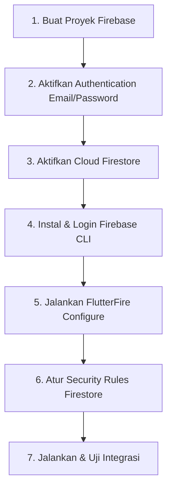

# Panduan Lengkap Setup Firebase Authentication & Cloud Firestore — ProjectKu

Dokumen ini berisi panduan terstruktur dan detail langkah demi langkah untuk menghubungkan aplikasi **ProjectKu (Freelancer Tracker)** dengan layanan **Firebase Authentication** dan **Firebase Cloud Firestore** agar aplikasi dapat melakukan login Email/Password dan melakukan sinkronisasi data secara real-time per akun.

---

## 📋 Prasyarat Sistem (Prerequisites)

Sebelum memulai, pastikan perangkat pengembangan Anda sudah memiliki:
1.  **Node.js & npm** (diperlukan untuk memasang Firebase CLI). Unduh di [nodejs.org](https://nodejs.org/).
2.  **Flutter SDK** terinstal dan telah masuk ke dalam variabel path sistem Anda.
3.  Akun **Google** aktif untuk mengakses konsol Firebase.

---

## 🗺️ Alur Setup & Integrasi



---

## 🛠️ Langkah Demi Langkah

### Langkah 1: Membuat Proyek Baru di Firebase Console
1.  Buka browser Anda dan navigasikan ke **[Firebase Console](https://console.firebase.google.com/)**.
2.  Klik tombol **Add Project** (Tambah Proyek).
3.  Masukkan nama proyek Anda, contoh: `ProjectKu-Freelancer`.
4.  *(Opsional)* Aktifkan Google Analytics untuk proyek Anda jika diperlukan, lalu klik **Continue**.
5.  Tunggu beberapa saat hingga pembuatan proyek selesai, kemudian klik **Continue** untuk masuk ke dashboard proyek Anda.

---

### Langkah 2: Mengaktifkan Authentication Email/Password
1.  Di Firebase Console, buka menu **Build** > **Authentication**.
2.  Masuk ke tab **Sign-in method**.
3.  Aktifkan provider **Email/Password**.
4.  Simpan perubahan.
5.  Tambahkan akun owner pertama di tab **Users** dengan email dan password yang akan dipakai untuk login aplikasi.

### Langkah 3: Mengaktifkan Cloud Firestore Database
1.  Di menu navigasi sebelah kiri Firebase Console, klik menu **Build** > **Firestore Database**.
2.  Klik tombol **Create Database** (Buat Database).
3.  **Tentukan Aturan Keamanan Awal:**
    *   Pilih **Start in test mode** (Mulai dalam mode pengujian). Pilihan ini memberikan izin penuh bagi siapa saja untuk membaca dan menulis data ke database selama 30 hari tanpa autentikasi (sangat ideal untuk tahap development).
    *   Klik **Next**.
4.  **Pilih Lokasi Server Database (Cloud Firestore Location):**
    *   Pilih lokasi server terdekat untuk meminimalkan latensi jaringan. Rekomendasi untuk Indonesia adalah `asia-southeast2` (Jakarta) atau `asia-southeast1` (Singapura).
    *   Klik **Enable** (Aktifkan).
5.  Firebase akan memproses pembuatan database. Setelah selesai, Anda akan diarahkan ke tab **Data** utama. Koleksi `projects` tidak perlu dibuat manual karena Firestore akan membuatnya otomatis begitu data pertama diunggah dari aplikasi.

---

### Langkah 4: Menginstal dan Menghubungkan Firebase CLI
1.  Buka Terminal (PowerShell di Windows, Terminal di macOS/Linux).
2.  Instal **Firebase CLI** secara global menggunakan npm:
    ```bash
    npm install -g firebase-tools
    ```
3.  Setelah instalasi selesai, hubungkan komputer Anda dengan akun Firebase Anda dengan mengetikkan:
    ```bash
    firebase login
    ```
4.  Jendela browser baru akan terbuka. Masuk menggunakan akun Google yang Anda gunakan untuk membuat proyek Firebase pada Langkah 1, lalu klik **Allow** (Izinkan).
5.  Kembali ke terminal, Anda akan melihat pesan sukses: `Success! Logged in as your_email@gmail.com`.

---

### Langkah 5: Menjalankan Konfigurasi FlutterFire CLI
FlutterFire CLI akan menghubungkan codebase Flutter Anda dengan proyek Firebase yang telah dibuat dan memperbarui berkas kredensial riil secara otomatis.

1.  Di terminal Anda, aktifkan FlutterFire CLI secara global menggunakan Dart SDK:
    ```bash
    dart pub global activate flutterfire_cli
    ```
    > [!NOTE]
    > Jika terminal memunculkan peringatan bahwa path pub belum terdaftar di Environment Variable, tambahkan path berikut ke variabel lingkungan Anda:
    > *   **Windows:** `%USERPROFILE%\AppData\Local\Pub\Cache\bin`
    > *   **macOS/Linux:** `$HOME/.pub-cache/bin`

2.  Masuk ke direktori root dari proyek `ProjectKu` Anda:
    ```bash
    cd path/to/ProjectKu
    ```
3.  Jalankan perintah inisialisasi FlutterFire:
    ```bash
    flutterfire configure
    ```
4.  **Ikuti langkah interaktif di Terminal:**
    *   Pilih proyek Firebase Anda: Cari dan pilih `projectku-freelancer-xxxx` (gunakan tombol panah dan enter).
    *   Pilih platform target: Centang `android`, `ios`, dan `web` (gunakan tombol spasi untuk memilih, lalu enter).
5.  Perintah ini akan secara otomatis:
    *   Membuat aplikasi Android, iOS, dan Web baru di bawah proyek Firebase Anda.
    *   Mengunduh berkas konfigurasi spesifik platform (seperti `google-services.json` untuk Android dan `GoogleService-Info.plist` untuk iOS).
    *   Menulis ulang berkas **[firebase_options.dart](../lib/firebase_options.dart)** dengan kredensial proyek riil Anda.

---

### Langkah 6: Mengatur Aturan Keamanan Firestore (Security Rules)
Agar data hanya dapat diakses oleh pemilik akun yang sedang login, gunakan aturan berikut:

1.  Kembali ke **Firebase Console** > **Firestore Database**.
2.  Buka tab **Rules** (Aturan) di bagian atas halaman.
3.  Ubah aturan keamanan Anda menjadi seperti berikut:
    ```javascript
    rules_version = '2';

    service cloud.firestore {
      match /databases/{database}/documents {
        match /projects/{document} {
          allow read: if request.auth != null && resource.data.userId == request.auth.uid;
          allow create: if request.auth != null && request.resource.data.userId == request.auth.uid;
          allow update, delete: if request.auth != null && resource.data.userId == request.auth.uid;
        }
      }
    }
    ```
4.  Klik tombol **Publish** (Publikasikan).

---

### Langkah 7: Pengujian Konektivitas & Menjalankan Aplikasi
1.  Jalankan pengujian unit widget di terminal untuk memastikan tidak ada kesalahan konfigurasi:
    ```bash
    flutter test
    ```
2.  Hubungkan perangkat fisik Android/iOS Anda atau nyalakan emulator.
3.  Jalankan aplikasi ProjectKu:
    ```bash
    flutter run
    ```
4.  **Tes Login:**
    *   Saat aplikasi dibuka, pastikan Anda diarahkan ke halaman login.
    *   Masukkan email dan password akun owner yang sudah dibuat.
    *   Setelah berhasil, aplikasi harus masuk ke dashboard.
5.  **Tes Tambah Proyek:**
    *   Klik tombol floating action button **"+"**.
    *   Isi semua formulir (Nama Proyek, Klien, Budget, Due Date, dan Deskripsi).
    *   Klik **Simpan ke Database**.
6.  **Periksa Hasil di Firebase Console:**
    *   Buka kembali **Firebase Console** > **Firestore Database** > Tab **Data**.
    *   Koleksi `projects` akan berisi dokumen dengan field `userId` sesuai akun login.

---

## ⚠️ Troubleshooting (Pecahan Masalah Umum)

#### 1. Masalah: Perintah `flutterfire` tidak dikenali (Command not found)
*   **Penyebab:** Lokasi binary pub Dart belum terdaftar di Environment Path OS Anda.
*   **Solusi:** Daftarkan path pub Dart secara manual di sistem Anda (lihat catatan pada Langkah 4 poin 1) atau jalankan perintah dengan awalan `dart pub global run`:
    ```bash
    dart pub global run flutterfire configure
    ```

#### 2. Masalah: Error `Firebase has not been initialized` saat menjalankan aplikasi
*   **Penyebab:** Panggilan inisialisasi Firebase gagal atau tidak berjalan sebelum aplikasi dimulai.
*   **Solusi:** Pastikan inisialisasi Firebase pada fungsi `main()` di berkas **[main.dart](../lib/main.dart)** sudah berjalan benar dan tidak melempar error:
    ```dart
    WidgetsFlutterBinding.ensureInitialized();
    await Firebase.initializeApp(
      options: DefaultFirebaseOptions.currentPlatform,
    );
    ```

#### 3. Masalah: Error `[firestore/permission-denied]` ketika mencoba menambah data
*   **Penyebab:** Aturan keamanan Firestore memblokir permintaan baca/tulis aplikasi Anda, atau dokumen belum memiliki `userId` yang sesuai.
*   **Solusi:** Pastikan user sudah login lewat Authentication Email/Password, lalu verifikasi bahwa `userId` pada dokumen `projects` sama dengan `request.auth.uid` (lihat Langkah 6).
