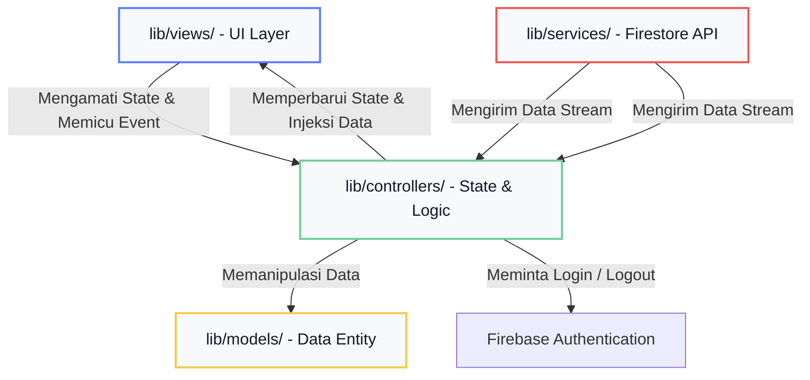

# 💼 Case Study Portofolio: ProjectKu (Calm Freelancer Workspace Tracker)

ProjectKu adalah sebuah aplikasi mobile manajemen proyek mandiri (*Freelance Tracker*) yang dirancang khusus untuk menciptakan ruang kerja digital yang tenang (*Calm Workspace*), membantu pekerja lepas (*freelancer*) memantau alur proyek, keuangan, dan tugas tanpa mengalami kelelahan visual (*visual fatigue*).

Dokumen ini disusun sebagai **Case Study Portofolio Profesional** untuk mendemonstrasikan keputusan arsitektur, implementasi teknis, otomatisasi perkakas (*developer tooling*), serta standar kualitas kode (*quality assurance*) yang diterapkan dalam proyek ini.

---

## 🚀 Ringkasan Teknis (Tech Stack & Key Highlights)

*   **Core SDK & Framework:** Flutter SDK & Dart (Material 3)
*   **State Management & DI:** [Riverpod](https://pub.dev/packages/flutter_riverpod) (Notifier, FutureProvider, ProviderScope)
*   **Navigation & Routing:** [GoRouter](https://pub.dev/packages/go_router) (Declarative Routing & Deep Linking)
*   **Authentication:** Firebase Authentication (Email & Password)
*   **Real-time Database:** Firebase Cloud Firestore
*   **Localization (Multi-bahasa):** `flutter_localizations` & `intl` (Bahasa Indonesia & Inggris)
*   **Code Quality / Linter:** `flutter_lints` (Analisis statis 100% bersih)
*   **Testing Suite:** Flutter Widget Testing (Mocking Stream Data Provider dengan Penanganan Responsive Wrap)
*   **Otomatisasi Alur:** Custom Dart Script (`tool/sync_app_flow.dart`) untuk visualisasi peta alur navigasi otomatis ke dalam format Markdown (Mermaid).

---

## 💡 Masalah & Solusi (Problem Statement & Solution)

### Latar Belakang Masalah
Para *freelancer* sering kali terpapar oleh antarmuka dasbor keuangan yang terlalu ramai (*high visual noise*), penuh dengan efek gradien mencolok, animasi berlebihan, dan skema warna jenuh. Hal ini menyebabkan kelelahan mata saat digunakan selama berjam-jam secara terus-menerus.

### Solusi: Calm Workspace Edition (v4)
ProjectKu v4 mengadopsi pendekatan **Luxury Editorial Minimalism** dengan prinsip-prinsip:
*   **Soft Contrast:** Menghindari warna hitam pekat atau putih murni untuk mengurangi kelelahan visual.
*   **Single-Purpose Metric Cards:** Alih-alih menggabungkan data keuangan, status, dan jumlah proyek dalam satu kartu besar, data tersebut dipecah secara mandiri menjadi kartu-kartu kecil terfokus (Revenue Card, Invoice Card, Project Card, Task Card).
*   **Responsive Card-First Layout:** Seluruh antarmuka secara ketat dibatasi dengan lebar maksimal **`480px`** untuk mempertahankan fokus informasi tetap terpusat dan mudah dioperasikan dengan satu tangan.

---

## 🏗️ Desain Arsitektur (Architectural Design)

ProjectKu menggunakan pola **MVC (Model-View-Controller) Architecture** yang memisahkan tanggung jawab UI (Views), logika bisnis dan pengaturan state (Controllers), serta pemodelan dan sumber data (Models & Services). Pemisahan ini memastikan kode mudah dipelihara, dikembangkan, dan diuji secara independen.



### Penjelasan Folder & Layer Kode
1.  **[lib/models/](../lib/models/) (Model):** Berisi entitas bisnis murni `Project`. Kelas ini bertugas mendefinisikan objek proyek serta melakukan serialisasi data dari dan ke format Firestore (`fromMap`, `toMap`).
2.  **[lib/views/](../lib/views/) (View):** Halaman UI dan widget custom (Material 3). View mengonsumsi state yang diekspos oleh controllers menggunakan ConsumerWidget dari Riverpod tanpa menulis logika bisnis di dalamnya.
3.  **[lib/controllers/](../lib/controllers/) (Controller):** Mengatur state penambahan proyek (`ProjectAddController`) dan alur interaksi dashboard (`ProjectListController`). Bertindak sebagai jembatan yang mengubah input pengguna menjadi operasi data.
4.  **[lib/services/](../lib/services/) (Service):** Mengisolasi interaksi dengan database Firebase Firestore. Menyediakan objek stream yang memancarkan perubahan data secara real-time ke aplikasi.
4.  **[lib/services/](../lib/services/) (Service):** Mengisolasi interaksi dengan Firebase Authentication dan database Firebase Firestore. Menyediakan objek stream yang memancarkan perubahan data secara real-time ke aplikasi.
5.  **[lib/views/auth/login_view.dart](../lib/views/auth/login_view.dart):** Halaman login Email & Password yang menjadi gerbang awal aplikasi.

---

## 🎨 Desain UI/UX & Sistem Token Visual

Aplikasi ini menggunakan **Calm Neutral Light Theme** dengan palet warna bersaturasi rendah untuk meminimalisasi visual fatigue.

### Palet Warna (Color System)
*   **Base Background (`0xFFF2F5F9`):** Soft grey netral untuk seluruh latar belakang aplikasi (bukan putih pekat).
*   **Surface Background (`0xFFF7F9FC`):** Latar belakang untuk kartu (*card background*) dan kontainer input.
*   **Elevated Surface (`0xFFFFFFFF`):** Putih murni yang digunakan secara eksklusif untuk kartu aktif, dialog, dan bottom sheets.
*   **Border Color (`0xFFE8EDF3`):** Batas tipis (1px) ber-opacity rendah yang digunakan untuk pembatas dan outline.
*   **Primary Accent (`0xFF5C7CFA`):** Indigo yang tenang untuk status aktif, fokus input, dan tombol utama (maksimal 10% dari total antarmuka).
*   **Semantic Accents:** Hijau mint (`0xFF6FCF97`) untuk status selesai/terbayar, emas hangat (`0xFFF2C94C`) untuk penundaan, dan merah lembut (`0xFFEB5757`) untuk kesalahan/tenggat terlewat.

### Sistem Grid & Corner Radii
*   **Layout Spacing:** Jarak konsisten antar-section sebesar 32px, antar-card 16px, dan jarak konten di dalam card sebesar 24px.
*   **Card Corner Radius:** Kartu-kartu utama menggunakan `borderRadius: 24`.
*   **Input Corner Radius:** Input form menggunakan `borderRadius: 16`.
*   **Segmented Control Corner Radius:** Tab filter menggunakan `borderRadius: 14` (dengan radius tombol aktif sebesar `10`).

---

## 🗄️ Skema Database Cloud Firestore

Data proyek disimpan di dalam koleksi **`projects`** pada Firebase Cloud Firestore dengan skema dokumen sebagai berikut:

| Nama Field | Tipe Data | Deskripsi | Opsi Nilai |
| :--- | :--- | :--- | :--- |
| `name` | `String` | Nama proyek freelance | - |
| `clientName` | `String` | Nama klien atau perusahaan | - |
| `userId` | `String` | UID pemilik proyek dari Firebase Authentication | wajib cocok dengan akun login |
| `createdAt` | `Timestamp` | Tanggal pembuatan entri data | - |

Semua query aplikasi sekarang dibatasi per akun login, sehingga hanya dokumen dengan `userId` yang cocok dengan `request.auth.uid` yang akan tampil dan bisa dimodifikasi.
| `budget` | `double` | Anggaran nominal total proyek | - |
| `dueDate` | `Timestamp` | Tenggat waktu pengerjaan proyek | - |
| `status` | `String` | Status pengerjaan proyek saat ini | `'In Progress'`, `'Completed'`, `'On Hold'` |
| `paymentStatus` | `String` | Status penagihan / pembayaran invoice | `'Unpaid'`, `'Invoice Sent'`, `'Paid'` |
| `description` | `String` | Catatan tambahan / ruang lingkup proyek | - |
| `createdAt` | `Timestamp` | Tanggal pembuatan entri data | - |

---

## ⚙️ Otomatisasi Alur Navigasi (Developer Tooling)

ProjectKu menggunakan skrip otomatisasi **[sync_app_flow.dart](../tool/sync_app_flow.dart)** untuk memindai konfigurasi rute GoRouter dan memvisualisasikan grafik navigasi secara dinamis ke dalam format Mermaid.

```bash
# Sinkronisasi alur satu kali
dart run tool/sync_app_flow.dart

# Mode pantau (watch mode) otomatis saat mengedit kode
dart run tool/sync_app_flow.dart --watch
```

---

## 🧪 Strategi Pengujian & Kualitas Kode (Quality Assurance)

Kualitas basis kode ProjectKu dijaga ketat dengan dua lapis validasi:

### 1. Analisis Statis Kode (Linter)
Proyek mematuhi konfigurasi lints dari `flutter_lints` dan bebas dari linter issues.
```bash
flutter analyze
# Output: No issues found! (Analisis 100% bersih)
```

### 2. Pengujian Widget & Unit (Widget Testing)
Pengujian UI ditulis pada berkas **[widget_test.dart](../test/widget_test.dart)**.
*   **Responsive Layout Wrap:** Penggunaan widget `Wrap` menggantikan `Row` pada penempatan tanggal dan badge status memastikan bahwa meskipun antarmuka berjalan pada layar sempit/padat, aplikasi tidak akan menghasilkan RenderFlex layout overflow.
*   **Widget Testing Validation:** Lulus 100% tervalidasi menggunakan data stream mock tanpa memicu koneksi database Firestore langsung.
```bash
flutter test
# Output: All tests passed! (Semua pengujian tervalidasi sukses)
```
