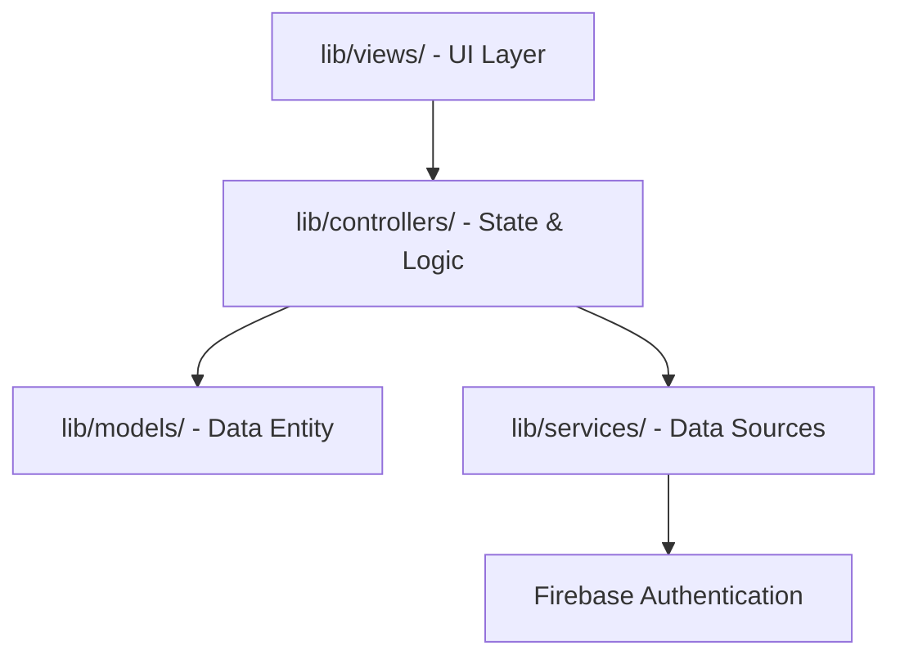

# ProjectKu — Freelancer Tracker Documentation

Selamat datang di dokumentasi resmi **ProjectKu**. Proyek ini adalah aplikasi pelacak manajemen proyek dan keuangan mandiri (*Freelance Tracker*) yang dibangun dengan **Flutter** dan diintegrasikan dengan **Firebase Cloud Firestore**.

---

## 🎯 Ringkasan Proyek (Overview)

**ProjectKu** dirancang untuk membantu *freelancer* melacak pengerjaan proyek, tenggat waktu (*due date*), anggaran pendapatan, serta status tagihan (*invoice*). 

Aplikasi ini menggunakan:
*   **Flutter SDK** (dengan dukungan Material 3).
*   **State Management:** [Riverpod](https://pub.dev/packages/flutter_riverpod) menggunakan pola `Notifier` dan `Provider`.
*   **Routing & Navigasi:** [GoRouter](https://pub.dev/packages/go_router) dengan routing deklaratif.
*   **Authentication:** [Firebase Authentication](https://firebase.google.com/products/auth) berbasis Email & Password.
*   **Database:** Real-time sync menggunakan [Cloud Firestore](https://pub.dev/packages/cloud_firestore).

---

## 🏗️ Struktur Arsitektur (Architecture)

Proyek ini menerapkan **MVC (Model-View-Controller) Architecture** dengan pemisahan yang bersih untuk memisahkan urusan UI, Logika Bisnis/Kontrol, dan Layanan Data.



### Layout Folder Utama
```text
lib/
├── controllers/            # Pengendali alur, manipulasi state, dan penanganan event
├── models/                 # Model entitas bisnis / domain murni
├── services/               # Integrasi dengan server eksternal / database (Auth, Firestore)
├── utils/                  # Helper fungsi format, styling tema, dan router config
└── views/                  # UI screens dan widget layout halaman
```

---

## 📂 Struktur Berkas & Komponen Utama

Berikut penjelasan detail dari berkas-berkas penting di dalam proyek ini:

### Penjelasan Folder & Layer Kode
1.  **[lib/models/](../lib/models/) (Model):** Berisi entitas bisnis murni `Project`. Kelas ini bertugas mendefinisikan objek proyek serta melakukan serialisasi data dari dan ke format Firestore (`fromMap`, `toMap`).
2.  **[lib/views/](../lib/views/) (View):** Halaman UI dan widget custom (Material 3). View mengonsumsi state yang diekspos oleh controllers menggunakan ConsumerWidget dari Riverpod tanpa menulis logika bisnis di dalamnya.
3.  **[lib/controllers/](../lib/controllers/) (Controller):** Mengatur state penambahan proyek (`ProjectAddController`), alur interaksi dashboard (`ProjectListController`), dan autentikasi (`AuthController`). Bertindak sebagai jembatan yang mengubah input pengguna menjadi operasi data.
4.  **[lib/services/](../lib/services/) (Service):** Mengisolasi interaksi dengan Firebase Authentication dan database Firebase Firestore. Menyediakan objek stream yang memancarkan perubahan data secara real-time ke aplikasi.
5.  **[lib/views/auth/login_view.dart](../lib/views/auth/login_view.dart):** Halaman login Email & Password dengan desain Calm Workspace.

### 4. Views (V)
*   **[project_list_view.dart](../lib/views/project/project_list_view.dart)**: Dashboard utama — menampilkan Revenue Card, ringkasan proyek, daftar kartu proyek dengan Status Chip & Progress Bar, serta tombol tambah proyek.
*   **[project_detail_view.dart](../lib/views/project/project_detail_view.dart)**: Halaman detail proyek — menampilkan header dengan inisial logo, progress bar, info list vertikal, daftar tugas (*checklist*), dan formulir edit inline.
*   **[project_add_view.dart](../lib/views/project/project_add_view.dart)**: Formulir validasi pembuatan proyek baru dengan Date Picker dan status default.

### 5. Widgets (Reusable Components)
*   **[status_chip.dart](../lib/views/widgets/status_chip.dart)**: Komponen pill status dengan indikator titik berwarna (biru, hijau, oranye, merah) sesuai status proyek.
*   **[custom_progress_bar.dart](../lib/views/widgets/custom_progress_bar.dart)**: Progress bar tipis adaptif — warna berubah otomatis sesuai kondisi (normal, mendekati deadline, overdue, selesai).

### 6. Utilities (Utils)
*   **[format_rupiah.dart](../lib/utils/format_rupiah.dart)**: Helper pemformat mata uang Rupiah untuk budget dan pemasukan.
*   **[router.dart](../lib/utils/router.dart)**: Konfigurasi routing deklaratif menggunakan `GoRouter`.
*   **[theme.dart](../lib/utils/theme.dart)**: Pengaturan tema Calm Workspace (Light Theme) Material 3 terpusat — token warna, tipografi Inter, dan tema komponen.

---

## 🗄️ Skema Database Cloud Firestore

Data disimpan di koleksi root bernama `projects`.

| Nama Field | Tipe Data | Deskripsi | Opsi Nilai |
| :--- | :--- | :--- | :--- |
| `name` | `String` | Nama proyek | - |
| `userId` | `String` | UID Firebase Authentication pemilik proyek | wajib cocok dengan `request.auth.uid` |
| `clientName` | `String` | Nama klien | - |
| `budget` | `double` | Nilai anggaran proyek | - |
| `dueDate` | `Timestamp` | Tenggat waktu pengerjaan | - |
| `status` | `String` | Status pengerjaan proyek | `'In Progress'`, `'Completed'`, `'On Hold'` |
| `paymentStatus` | `String` | Status tagihan | `'Unpaid'`, `'Invoice Sent'`, `'Paid'` |
| `description` | `String` | Deskripsi atau catatan proyek | - |
| `createdAt` | `Timestamp` | Waktu pembuatan entri | - |

### Aturan Kepemilikan Data
Semua query dan operasi tulis sekarang dibatasi per user yang login. Aplikasi hanya menampilkan dokumen `projects` yang memiliki `userId` sesuai akun aktif.

---

## 🔄 Otomatisasi Alur Navigasi (Developer Tooling)

Proyek ini dilengkapi dengan skrip sinkronisasi alur otomatis **[sync_app_flow.dart](tool/sync_app_flow.dart)** yang memindai konfigurasi rute dan memvisualisasikannya ke dalam format Mermaid. Jalankan untuk menghasilkan peta navigasi terkini:

```bash
# Sinkronisasi satu kali
dart run tool/sync_app_flow.dart

# Mode pantau (Watch mode) real-time saat Anda mengedit rute
dart run tool/sync_app_flow.dart --watch
```

---

## 🧪 Kualitas Kode & Pengujian (Testing)

Proyek ini telah dikonfigurasi agar bebas dari masalah analisis statis dan memiliki pengujian UI yang tervalidasi.

### 1. Analisis Kode (Code Quality)
Aplikasi mematuhi standar analisis dari `flutter_lints` dan telah disesuaikan agar bersih dari penggunaan properti usang (seperti menggunakan `.withValues(alpha: ...)`).
Jalankan analisis kode kapan saja dengan:
```bash
flutter analyze
```

### 2. Pengujian Widget (Widget Testing)
Pengujian UI kritis terdapat pada berkas **[widget_test.dart](../test/widget_test.dart)**. Test ini memvalidasi komponen dashboard serta list menggunakan mock data stream provider tanpa memicu koneksi database Firestore langsung.
Jalankan pengujian dengan:
```bash
flutter test
```

### 3. Alur Autentikasi
Saat aplikasi dibuka, router akan mengarahkan pengguna yang belum login ke `/login`. Setelah berhasil sign in, pengguna diarahkan ke dashboard, dan aksi logout akan mengembalikan pengguna ke halaman login.

---

> [!TIP]
> **Praktik Terbaik:** Saat menambahkan rute navigasi baru di [router.dart](lib/utils/router.dart), selalu jalankan skrip sinkronisasi alur untuk memperbarui diagram peta navigasi proyek.
