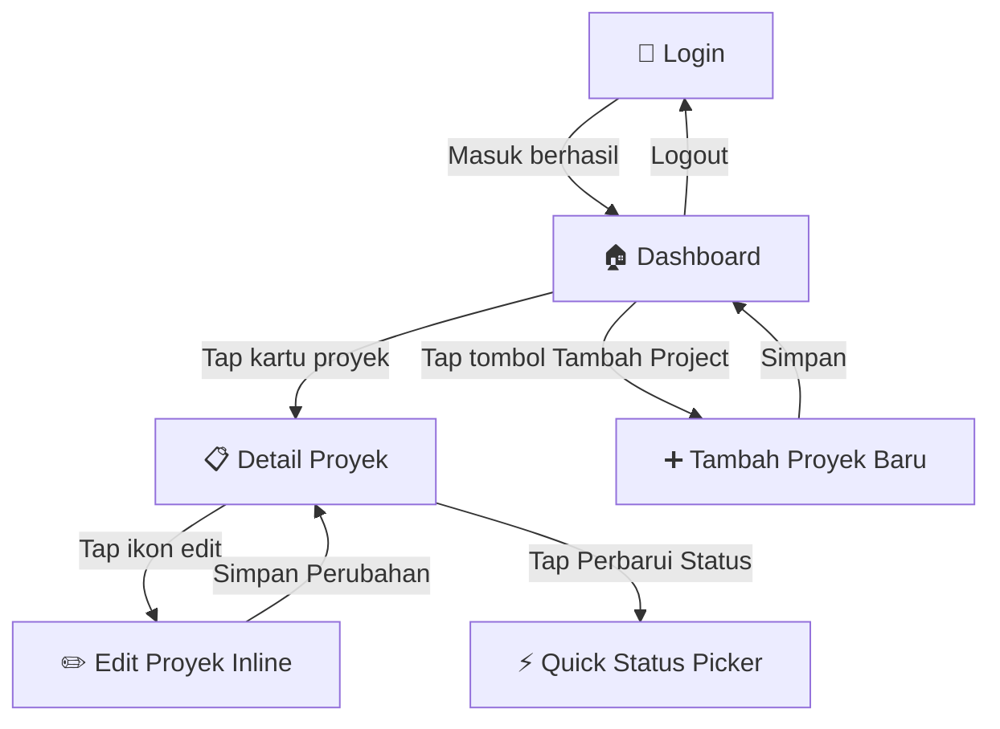

# 📱 Panduan Penggunaan — ProjectKu

Dokumen ini menjelaskan fitur-fitur aplikasi **ProjectKu** dan cara menggunakannya secara lengkap.

---

## 🗺️ Alur Navigasi Aplikasi

---

## 1. 🔐 Login

Halaman awal aplikasi yang muncul sebelum dashboard.

### Cara Masuk
- Masukkan email owner dan password yang sudah dibuat di Firebase Authentication.
- Tekan tombol **Masuk**.
- Jika login berhasil, aplikasi otomatis pindah ke dashboard.

### Pesan Error
- Email tidak valid
- Password salah
- Akun dinonaktifkan
- Koneksi jaringan bermasalah

---

## 2. 🏠 Dashboard

Halaman utama aplikasi yang terbuka setelah login berhasil.

### Kartu Ringkasan Keuangan
Di bagian atas terdapat dua kartu informasi:

| Kartu | Isi |
|---|---|
| **Total Pendapatan Lunas** | Jumlah total budget semua proyek berstatus `Paid` |
| **Tagihan Tertunda** | Jumlah total budget proyek berstatus `Unpaid` atau `Invoice Sent` |
| **Proyek Aktif** | Jumlah proyek yang belum berstatus `Completed` |
| **Ringkasan Project** | Total proyek, jumlah selesai, dan circular progress rate |

Seluruh ringkasan hanya menghitung proyek milik akun yang sedang login.

### Filter Tab
Gunakan tiga tab di atas daftar proyek untuk menyaring tampilan:

| Tab | Menampilkan |
|---|---|
| **Semua** | Seluruh proyek milik user aktif |
| **Aktif** | Hanya proyek berstatus `In Progress` |
| **Selesai** | Hanya proyek berstatus `Completed` |

### Kartu Proyek
Setiap proyek ditampilkan sebagai kartu berisi:
- **Inisial proyek** (huruf pertama nama proyek) dalam lingkaran
- **Nama proyek** dan nama klien
- **Status Chip** berwarna di sisi kanan (biru = aktif, hijau = selesai, abu-abu = ditahan)
- **Progress Bar** yang mencerminkan persentase tugas yang selesai dari total tugas

> **Warna Progress Bar:**
> - 🔵 Normal — biru indigo
> - 🟡 Mendekati deadline atau progress >80% — oranye
> - 🔴 Overdue (tenggat terlewat) — merah
> - 🟢 Selesai 100% — hijau

### Hapus Proyek (Swipe-to-Delete)
Geser kartu proyek **ke kiri** untuk menampilkan tombol hapus merah. Konfirmasi dialog akan muncul sebelum data dihapus permanen.

### Tombol Tambah Project
Tombol penuh di bagian bawah layar. Tap untuk membuka formulir tambah proyek baru.

### Logout
Tap ikon profil di kanan atas, lalu pilih **Keluar** untuk sign out dan kembali ke halaman login.

---

## 3. ➕ Tambah Proyek Baru

Formulir untuk membuat entri proyek baru ke dalam database.

### Field yang Wajib Diisi

| Field | Keterangan |
|---|---|
| **Nama Proyek** | Judul atau nama pekerjaan freelance |
| **Nama Klien** | Nama individu atau perusahaan klien |
| **Anggaran (Rp)** | Nilai kontrak dalam Rupiah (angka saja, tanpa titik/koma) |
| **Tenggat Waktu** | Pilih tanggal deadline via Date Picker |

### Field Opsional

| Field | Keterangan |
|---|---|
| **Status Pengerjaan** | Default: `In Progress`. Pilih dari: `In Progress`, `Completed`, `On Hold` |
| **Status Pembayaran** | Default: `Unpaid`. Pilih dari: `Unpaid`, `Invoice Sent`, `Paid` |
| **Deskripsi** | Catatan bebas, ruang lingkup pekerjaan, atau instruksi khusus klien |

Tap **Simpan ke Database** untuk menyimpan. Data langsung muncul di dashboard secara real-time.

Dokumen baru akan otomatis menyimpan `userId` milik akun yang sedang login.

---

## 4. 📋 Detail Proyek

Halaman detail yang terbuka saat tap kartu proyek dari dashboard.

### Header Proyek
Menampilkan:
- Inisial proyek dalam lingkaran
- Nama proyek dan nama klien
- Status Chip terkini
- Progress Bar keseluruhan tugas

### Informasi Proyek
Daftar vertikal berisi:
- 📅 **Deadline** — tanggal tenggat waktu (merah jika sudah terlewat)
- 💰 **Anggaran** — nilai kontrak dalam format Rupiah
- 🗓️ **Dibuat** — tanggal entri proyek pertama kali dibuat

### Deskripsi
Ditampilkan hanya jika ada isi. Berisi catatan atau ruang lingkup pekerjaan.

### ✅ Daftar Tugas (Checklist)
Fitur manajemen tugas terintegrasi dalam setiap proyek:
- **Tambah tugas baru** — ketik nama tugas di kolom input, lalu tekan Enter atau tombol `+`
- **Centang tugas** — tap checkbox untuk menandai tugas sebagai selesai. Progress bar di header otomatis diperbarui
- **Hapus tugas** — tap ikon tong sampah di sebelah kanan nama tugas

### ⚡ Perbarui Status (Quick Update)
Tap tombol **Perbarui Status** untuk membuka bottom sheet cepat ganti:
- Status pengerjaan: `In Progress` / `Completed` / `On Hold`
- Status pembayaran: `Unpaid` / `Invoice Sent` / `Paid`

Perubahan langsung tersimpan ke Firestore tanpa perlu masuk mode edit.

Jika pengguna lain membuka aplikasi, proyek ini tidak akan terlihat karena data dibatasi oleh `userId`.

---

## 5. ✏️ Edit Proyek

Tap ikon **pensil** di AppBar halaman detail untuk masuk ke mode edit inline.

Seluruh field bisa diubah:
- Nama proyek dan nama klien
- Nilai anggaran
- Tanggal deadline (via Date Picker)
- Status pengerjaan dan status pembayaran
- Deskripsi

Tap **Simpan Perubahan** untuk menyimpan. Tap ikon **✕** untuk membatalkan tanpa menyimpan.

---

## 6. 🗑️ Hapus Proyek

Proyek dapat dihapus dari dua tempat:
1. **Dari dashboard** — geser kartu ke kiri (swipe-to-delete)
2. **Dari detail proyek** — scroll ke bawah, tap tombol **Hapus Proyek** berwarna merah

Keduanya akan menampilkan dialog konfirmasi sebelum data dihapus secara permanen dari Firestore.

---

## Ringkasan Status

### Status Pengerjaan

| Nilai | Arti | Warna Chip |
|---|---|---|
| `In Progress` | Proyek sedang dikerjakan | 🔵 Biru |
| `Completed` | Proyek selesai | 🟢 Hijau |
| `On Hold` | Proyek ditahan / dijeda | ⚪ Abu-abu |

### Status Pembayaran

| Nilai | Arti | Warna Chip |
|---|---|---|
| `Unpaid` | Belum ada pembayaran | 🔴 Merah |
| `Invoice Sent` | Invoice sudah dikirim ke klien | 🟡 Kuning |
| `Paid` | Pembayaran sudah diterima | 🟢 Hijau |

---

> [!NOTE]
> Seluruh perubahan data (tambah, edit, hapus) tersinkronisasi secara real-time ke Firebase Cloud Firestore. Jika Anda membuka aplikasi di dua perangkat sekaligus, perubahan akan langsung terlihat di kedua perangkat tanpa perlu refresh.
