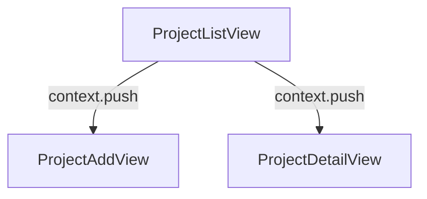

# Peta Navigasi & Alur Aplikasi (Flow Map)

Dokumen ini menjelaskan alur navigasi dari aplikasi **Tugas**. 
Peta alur di bawah ini mencerminkan struktur navigasi aktual yang dibangun menggunakan routing deklaratif.

## Alur Navigasi Manual
Berikut adalah peta navigasi konseptual utama:
1. **Splash Screen** -> **Onboarding** (jika pertama kali membuka aplikasi)
2. **Onboarding / Splash Screen** -> **Login / Register**
3. **Login / Register** -> **Home Screen** (Halaman Utama)

---

<!-- AUTO_FLOW_START -->
## Auto-Generated Flow Map

> Bagian ini dihasilkan otomatis oleh `tool/sync_app_flow.dart`.
> Jangan edit manual di antara marker START/END karena akan ditimpa saat sinkronisasi.

**Generated at:** 2026-06-26 10:04:32.515610
**Detected nodes:** 3
**Detected transitions:** 2

### Detected Transitions

- ProjectListView -> ProjectAddView (context.push) [lib/views/project/project_list_view.dart:179]
- ProjectListView -> ProjectDetailView (context.push) [lib/views/project/project_list_view.dart:674]
<!-- AUTO_FLOW_END -->
