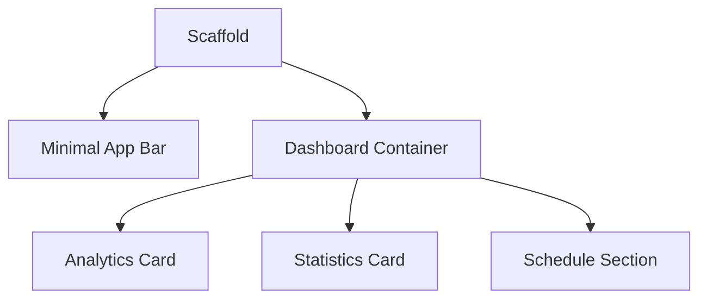

# 💎 UI/UX Design System Documentation — ProjectKu v4

## Calm Workspace Edition

This document serves as the comprehensive UI/UX reference manual for **ProjectKu (Freelancer Workspace)**.

The visual direction is inspired by calm productivity applications and editorial interfaces that prioritize:

* breathing room,
* soft contrast,
* minimal hierarchy,
* low visual noise,
* premium simplicity.

The interface should feel like:

> **a tool you use every day for hours without visual fatigue.**

It should not feel like:

* fintech dashboard
* cyberpunk interface
* AI generated Dribbble concept
* startup landing page

---

# 🎨 1. Visual Token Foundations

## Design Philosophy

The reference interface follows four principles:

### Soft Contrast

No pure black and no pure white.

### Monochromatic Surfaces

Most elements belong to one color family.

### Extremely Low Visual Noise

Almost no shadows, gradients, or glowing effects.

### Generous White Space

Spacing creates hierarchy instead of colors.

---

# Color System

## Base Background

```dart
Color(0xFFF2F5F9)
```

Soft neutral grey.

Never use pure white.

---

## Surface Background

```dart
Color(0xFFF7F9FC)
```

Used for:

* cards
* sections
* input containers.

---

## Elevated Surface

```dart
Color(0xFFFFFFFF)
```

Used only for:

* active cards
* dialogs
* bottom sheets.

---

## Border

```dart
Color(0xFFE8EDF3)
```

Used for:

* dividers
* segmented controls
* inputs.

---

# Typography Colors

## Text Primary

```dart
Color(0xFF111827)
```

---

## Text Secondary

```dart
Color(0xFF6B7280)
```

---

## Text Tertiary

```dart
Color(0xFF9CA3AF)
```

---

# Accent System

The reference image uses almost no accent colors.

## Primary Accent

```dart
Color(0xFF5C7CFA)
```

Usage:

* active tabs
* focused state
* primary button.

Maximum usage:

```text
10%
```

---

## Success Accent

```dart
Color(0xFF6FCF97)
```

Used only for:

* positive statistics
* small indicators.

---

## Warning Accent

```dart
Color(0xFFF2C94C)
```

---

## Error Accent

```dart
Color(0xFFEB5757)
```

---

# Color Ratio

```text
85% Neutral
10% Primary
5% Semantic
```

This ratio is the reason why the reference feels calm.

---

# 🔠 2. Typography System

## Font Family

```text
Inter
SF Pro Display
Outfit
```

Prefer:

```text
Inter
```

because it matches the reference.

---

| Style          | Size | Weight |
| -------------- | ---- | ------ |
| Display Large  | 34   | w700   |
| Heading Large  | 28   | w600   |
| Heading Medium | 22   | w600   |
| Title          | 18   | w600   |
| Body           | 16   | w400   |
| Caption        | 14   | w400   |
| Small          | 12   | w400   |

---

# Typography Philosophy

The reference rarely uses bold typography.

Most text is:

```text
400
500
600
```

Almost never:

```text
800
900
```

because heavy weights make the interface aggressive.

---

# 📏 3. Spacing System

The strongest characteristic of the reference is spacing.

---

## Scale

```text
4
8
12
16
24
32
48
64
```

---

## Layout Rule

Between sections:

```text
32px
```

Between cards:

```text
16px
```

Between content inside cards:

```text
24px
```

---

# Corner Radius System

## Card

```text
24
```

---

## Input

```text
16
```

---

## Segmented Control

```text
14
```

---

## Small Chip

```text
12
```

---

# 🌑 4. Elevation System

The reference barely uses shadows.

---

## Level 1

```dart
BoxShadow(
  color: Colors.black.withOpacity(.03),
  blurRadius: 20,
  offset: Offset(0,4),
)
```

---

## Level 2

```dart
BoxShadow(
  color: Colors.black.withOpacity(.05),
  blurRadius: 24,
  offset: Offset(0,8),
)
```

No glow.

No large shadows.

No colored shadows.

---

# 🏗️ 5. Component Architecture



---

# 📱 Dashboard Screen

The reference uses a **vertical information architecture**.

---

## Header

```text
Dashboard
```

Simple.

No greeting.

No large hero section.

---

## Analytics Card

Contains:

* metric
* small trend badge
* chart.

Card layout:

```text
Metric
Trend

Chart
```

---

## Statistics Card

Contains:

* category values
* mini chart
* dropdown selector.

---

## Schedule Card

Contains:

* segmented tabs
* pending items
* schedule timeline.

---

# Component Philosophy

Each card has:

```text
One purpose only.
```

Never mix:

* finances
* projects
* analytics
* tasks

inside one container.

---

# ProjectKu Adaptation

Instead of:

```text
Revenue
Projects
Invoices
Status
```

inside one hero card,

split them into:

```text
Revenue Card
Project Card
Invoice Card
Task Card
```

This matches the reference.

---

# Cards

## Background

```dart
Color(0xFFF7F9FC)
```

---

## Radius

```text
24
```

---

## Border

```dart
Color(0xFFE8EDF3)
```

---

## Padding

```text
24
```

---

# Buttons

The reference uses very soft buttons.

---

## Primary

```dart
Background:
#5C7CFA

Text:
White
```

---

## Secondary

```dart
Background:
White

Border:
#E8EDF3
```

---

# Segmented Control

```dart
Background:
#F1F5F9
```

Active:

```dart
Background:
White
```

---

# Charts

The charts use:

* rounded bars
* monochromatic colors
* soft gradients.

No neon.

No saturated colors.

---

# Icons

Icons are:

```text
20px
24px
```

Outline style.

Never filled.

---

# 📱 Responsive System

The reference follows a card-first layout.

```dart
ConstrainedBox(
  constraints:
      BoxConstraints(maxWidth: 480),
)
```

Unlike dashboards, it intentionally keeps content narrow.

---

# 🎯 Final Design Direction

## Keywords

```text
Calm
Editorial
Soft
Minimal
Human
Professional
Timeless
```

---

# Product Vision

ProjectKu should feel like:

> A beautifully crafted productivity tool that disappears into the background and lets freelancers focus on their work.

Not:

> A flashy dashboard trying to impress users with effects.
