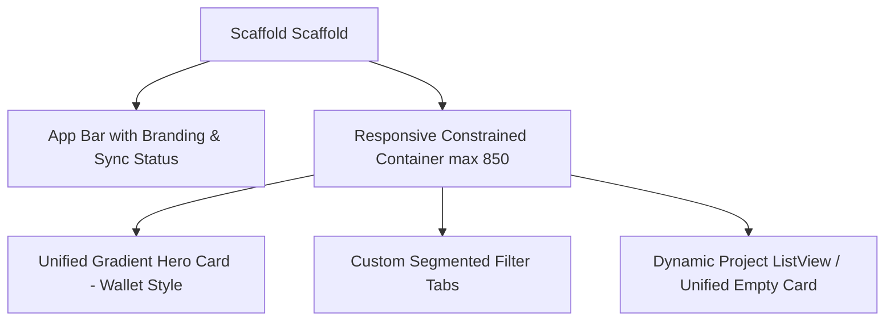

# 💎 UI/UX Design System Documentation — ProjectKu

This document serves as the comprehensive UI/UX reference manual for the **ProjectKu (Freelancer Workspace)** application. It defines the visual foundations, custom widget component architectures, and responsive layout guidelines applied to achieve a premium, high-contrast, and clean interface.

---

## 🎨 1. Visual Token Foundations

We use a curated, non-generic dark palette to avoid typical "template-like" visual aesthetics.

### Color Palette
*   **Deep Base Background:** `0xFF0A0F1D` (Ultra deep slate-black used for scaffolds).
*   **Card & Surface Background:** `0xFF151D30` (Muted dark navy-blue card containers).
*   **Text Primary:** `0xFFF8FAFC` (Slate-white high readability headings).
*   **Text Secondary:** `0xFF64748B` (Cool slate-grey description text).
*   **Sky Blue Accent:** `0xFF38BDF8` (Sky blue primary brand elements, active focus, and "In Progress" badges).
*   **Mint Emerald Accent:** `0xFF34D399` (Mint green used for "Paid" financial highlights and "Completed" badges).
*   **Warm Amber Warning:** `0xFFFBBF24` (Warm warning color used for "Invoice Sent" and "On Hold" statuses).
*   **Soft Rose Red Error:** `0xFFF87171` (Rose red warning color used for "Unpaid" items and overdue alerts).

### Typography Scale (Outfit Font)
*   **Headline Large:** `32pt`, weight `w900`, tracking `-0.8` (Dashboard/Welcome title).
*   **Headline Medium:** `24pt`, weight `bold`, tracking `-0.5` (Section headings).
*   **Title Large:** `18pt`, weight `bold` (List item headings, modal dialog titles).
*   **Body Large:** `16pt`, weight `normal` (Default text sizes).
*   **Body Medium:** `14pt`, weight `normal`, color slate-grey (Secondary info, descriptions).

### Spacing & Corner Radii
*   **Unified Corner Radii:** Cards use `borderRadius: 24`, choice selectors use `borderRadius: 16`.
*   **Padding Scale:** Unified using increments of `4` (`4`, `8`, `12`, `14`, `16`, `20`, `24`, `32`, `48`).

---

## 🏗️ 2. Component Architecture & Screens

### A. Dashboard Halaman Utama (ProjectListView)

1.  **Sleek Wallet-Styled Hero Card:**
    *   Displays **Total Pendapatan Lunas** (Paid invoices) as the hero metric in extra-large typography.
    *   Features a secondary verified badge highlighting active data.
    *   Splits the bottom section into two distinct segments: **Tagihan Tertunda** (with amber dot indicator) and **Proyek Aktif** (with blue dot indicator).
    *   Styled with a dark navy-to-charcoal gradient (`Color(0xFF1E2640)` -> `Color(0xFF0F1524)`) and a subtle glowing shadow.
2.  **Segmented Filter Tab Bar:**
    *   Horizontal button strip allowing instant toggle between "Semua", "Dikerjakan", and "Selesai".
    *   Uses an inner container background of Color `0xFF0F1524` with sharp borders for high contrast.
3.  **Project Item Card:**
    *   Glass-like frame with white borders at low opacity (`Color(0x0CFFFFFF)`).
    *   **Time-Remaining Progress Bar:** Displays time elapsed from creation date to due date.
        *   *Consistent Height:* When a project is marked **Completed**, the progress indicator remains visible at `100%` in emerald green to prevent card height collapse.
        *   *Dynamic Coloring:* Turns red if **Overdue**, amber if less than 3 days remain, and blue for regular timelines.
4.  **Unified Empty State Container:**
    *   Consistent visual card formatting with a centered circular folder/filter icon, bold header text, and descriptive subtitle guiding the next action.

### B. Formulir Tambah Proyek (ProjectAddView)

1.  **Form Input Field Styling:**
    *   Text fields use a contrasting input background (`Color(0xFF0F1524)`) with high-contrast active focused borders (`primaryColor`, width `1.5`).
2.  **Interactive Segmented Choice Pill Selector:**
    *   Replaces standard dropdown components.
    *   Allows immediate interactive selection with animated container fills indicating selection, custom colored active borders, and clear state indicators.

---

## 📱 3. Responsive & Device Adaptability

Following the `flutter-build-responsive-layout` principles:
*   The layouts are wrapped in `ConstrainedBox(constraints: BoxConstraints(maxWidth: 850))` and centered.
*   This ensures the dashboard looks cohesive on mobile, but maintains a centralized, clean dashboard shape on iPad/Tablets, Web browsers, and Desktop platforms, avoiding stretched text lines and over-extended metrics.
